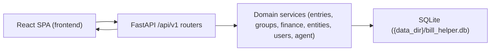

# High-Level Data Flow and Group Model (Current MVP)

This document summarizes end-to-end flows for the current implementation: manual ledger writes, unified groups, dashboard reads, and agent review-gated proposals.

## System View

Bill Helper is a local-first multi-user app with a React frontend, FastAPI backend, and SQLite storage.

## Unified Group Model

Groups are first-class records with two sources:

- `manual`: explicit many-to-many entry membership through `group_members`
- `rule`: recursive include/exclude definitions in `groups.definition_json`, plus optional per-entry `include` / `exclude` overrides

Storage:

- Group table: `groups`
- Membership table: `group_members`
- Entry table: `entries`

Rules:

1. Users create manual groups and add entries, or create rule groups with saved analytics rules.
2. Entry reads compute effective membership across all owned groups.
3. Rule groups may overlap; they are auxiliary dashboard cross-cuts, not the primary expense partition.
4. There is no typed graph model, child-group nesting, or derived edge storage.

Implemented in `backend/services/groups.py`, `backend/services/group_membership.py`, and `backend/services/group_rules.py`.

## Storage Model (High Level)

Primary tables:

- `entries`: core expense/income/transfer records, entity refs, soft-delete flags, markdown note body.
- `groups`: principal-owned manual or rule groups.
- `group_members`: explicit manual membership and rule-group override rows.
- `accounts`, `account_snapshots`: account metadata and reconciliation checkpoints.
- `users`: normalized owners used by entries/accounts/groups.
- `user_files`: canonical per-user registry for durable uploads.
- `entities`: normalized names for `from`/`to` and account-linked entities.
- `tags`, `entry_tags`: tag catalog and many-to-many entry mapping.
- `taxonomies`, `taxonomy_terms`, `taxonomy_assignments`: reusable categorical system for entities/tags/entries.
- `sessions`: password-backed bearer sessions stored as hashed token digests.

Agent harness and review tables:

- `agent_threads`, `agent_runs`, `agent_transcript_messages`, `agent_steps`, `agent_tool_calls`, `agent_run_events`
- `agent_change_items`, `agent_review_actions`, `agent_transcript_attachments`
- `agent_threads.owner_user_id` scopes the agent timeline and all nested run resources to a specific user
- transcript attachment rows reference canonical `user_files` records under `{data_dir}/user_files/{user_id}/uploads/...`

Note: entry-level status has been removed; review state lives in `agent_change_items`.

## End-to-End Data Flow

### Manual Write Path (Entry Create/Update)

1. Frontend submits to `/api/v1/entries` or `/api/v1/entries/{id}`.
2. Popup editor serializes notes into `markdown_body`.
3. Optional `group_ids` are sent from the same modal when the user assigns manual groups inline.
4. Router validates payload with Pydantic schemas.
5. Services normalize tags/entities/users, then apply manual group memberships through the group service.
6. SQLAlchemy writes rows to SQLite and commits.
7. Frontend invalidates query caches and refreshes dependent views.
8. Entry reads expose `groups[]`; new entries default to no memberships until assigned or matched by rules.

### Group Mutation Path

1. Group create, update, delete, add-member, or remove-member mutates `groups` and/or `group_members`.
2. Backend validates ownership, source-specific rules, and override semantics.
3. Group reads (`GET /groups`, `GET /groups/{group_id}`) return summaries, members, and parsed rules.
4. Entry reads recompute effective membership from manual rows, rule evaluation, and overrides.

### Agent-Assisted Write Path (Review-Gated)

1. User sends message to `/api/v1/agent/threads/{thread_id}/messages` (background run) or `/api/v1/agent/threads/{thread_id}/messages/stream` (SSE token stream).
2. Agent runtime executes the `run_bh` tool and runs `bh` for Bill Helper reads and proposal creation.
3. Proposed creates are persisted as `agent_change_items` (`PENDING_REVIEW`).
4. Human reviewer approves/rejects individual items.
5. On approval, apply handlers create domain rows (including entries) and record review actions.
6. Agent-created entries remain ungrouped until a user assigns manual groups or saved rules match them.

### Read Path (Dashboard + Account Reconciliation)

1. Frontend calls `/api/v1/dashboard?month=YYYY-MM` and account reconciliation endpoints.
2. Finance service computes:
   - runtime-configured currency monthly KPIs
   - saved rule-group month totals in `groups[]`
   - daily and monthly expense series grouped by entry category and lifecycle
   - monthly trend, breakdowns (`from`, `to`, `tag`)
   - weekday distribution, largest expenses, projection
   - account reconciliation interval summaries for the account workspace
3. Frontend renders dashboard charts/tables from the aggregated payload and renders account reconciliation in the accounts workspace.

### Rule-Group Configuration Path

1. Frontend calls `/api/v1/groups` and creates or edits groups with `source=rule`.
2. Backend returns only the caller's saved groups; an empty list is valid.
3. Users create or edit recursive include/exclude rules with nested `AND`/`OR` groups.
4. Dashboard reads consume saved rule groups as optional overlapping cross-cuts.

## Module Map

- API routers:
  - `backend/routers/entries.py`
  - `backend/routers/groups.py`
  - `backend/routers/dashboard.py`
  - `backend/routers/accounts.py`
  - `backend/routers/agent.py`
  - `backend/routers/settings.py`
- Core services:
  - `backend/services/groups.py`
  - `backend/services/group_membership.py`
  - `backend/services/group_rules.py`
  - `backend/services/entries.py`
  - `backend/services/entities.py`
  - `backend/services/users.py`
  - `backend/services/runtime_settings.py`
  - `backend/services/taxonomy.py`
  - `backend/services/finance_dashboard.py`
  - `backend/services/finance_dashboard_rollups.py`
- Agent services:
  - `backend/services/agent/harness/`
  - `backend/services/agent/production_runtime.py`
  - `backend/services/agent/production_repository.py`
  - `backend/services/agent/model_gateway.py`
  - `backend/services/agent/prompt_assembly/thread_context.py`
  - `backend/services/agent/runtime.py`
  - `backend/services/agent/tool_runtime_support/`
  - `backend/services/agent/read_tools/`
  - `backend/services/agent/proposals/`
  - `backend/services/agent/terminal.py`
  - `backend/services/agent/tool_args/`
  - `backend/services/agent/proposal_patching.py`
  - `backend/services/agent/reviews/`
  - `backend/services/agent/apply/`
- Models/contracts:
  - `backend/models_finance.py`
  - `backend/models_agent.py`
  - `backend/schemas_finance.py`
  - `backend/schemas_group_rules.py`
  - `backend/schemas_agent.py`
- Frontend access/render paths:
  - `frontend/src/lib/api.ts`
  - `frontend/src/lib/queryInvalidation.ts`
  - `frontend/src/pages/EntriesPage.tsx`
  - `frontend/src/pages/EntryDetailPage.tsx`
  - `frontend/src/pages/GroupsPage.tsx`
  - `frontend/src/features/groups/GroupRuleEditorSection.tsx`
  - `frontend/src/components/GroupEditorModal.tsx`
  - `frontend/src/components/GroupMemberEditorModal.tsx`
  - `frontend/src/pages/DashboardPage.tsx`
  - `frontend/src/pages/AccountsPage.tsx`
  - `frontend/src/features/accounts/*`
  - `frontend/src/pages/PropertiesPage.tsx`
  - `frontend/src/features/properties/*`
  - `frontend/src/features/agent/AgentPanel.tsx`
  - `frontend/src/features/agent/panel/*`

## Operational Impact

- Migration path includes historical group migrations through `0049_unified_groups`, which merges legacy `entry_groups` / `filter_groups` storage into unified `groups` / `group_members`.
- Operational commands:
  - `uv run alembic upgrade head`
  - `uv run python scripts/bootstrap_admin.py --name <user> --password <pass>`
  - `uv run bill-helper-api`
  - `uv run pytest`
  - `uv run python scripts/check_docs_sync.py`
- Relevant environment variables:
  - `BILL_HELPER_DATABASE_URL`
  - `BILL_HELPER_DEFAULT_CURRENCY_CODE`
  - `BILL_HELPER_DASHBOARD_CURRENCY_CODE`
  - `BILL_HELPER_AGENT_MODEL`
  - provider credentials for selected model (for example `OPENAI_API_KEY`, `ANTHROPIC_API_KEY`, `OPENROUTER_API_KEY`)

## Current Constraints and Limitations

- app auth is still prototype-grade and limited to admin/non-admin roles
- manual groups support many-to-many entry membership; rule groups derive membership and allow per-entry overrides only
- dashboard analytics use runtime-configured currency selection (`/settings` override, else env default)
- overlapping rule groups can make summed cross-cut shares exceed `100%`
